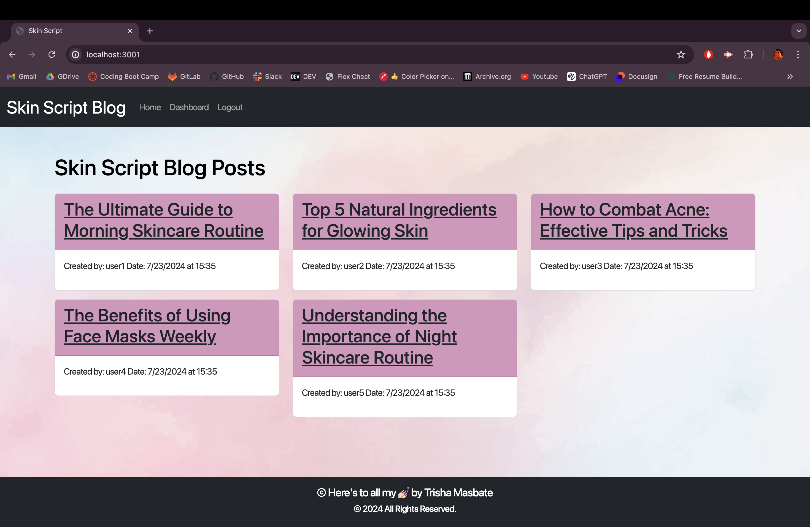

# 💅🏻  Skin Script Blog

[](https://github.com/trishamasbate)
[](https://choosealicense.com/licenses/mit/)


## 📃 Description:
**Skin Script** is a CMS-style platform dedicated to skincare enthusiasts and experts, offering valuable tips, articles, and insights on maintaining healthy skin. Users can publish blog posts, share their skincare routines, and comment on others' posts. The site features easy navigation, user authentication, and a personalized dashboard for managing posts. Perfect for those passionate about skincare, the Skin Script Blog fosters a community where users can exchange knowledge and stay updated on the latest skincare trends.

## 📌 Table of Contents
- [💅🏻  Skin Script Blog](#--skin-script-blog)
  - [📃 Description:](#-description)
  - [📌 Table of Contents](#-table-of-contents)
  - [🔎 User Story](#-user-story)
  - [✅ Acceptance Criteria](#-acceptance-criteria)
  - [💡 Usage and Installation Instructions](#-usage-and-installation-instructions)
  - [🎞️ Previews and Walkthrough Videos:](#️-previews-and-walkthrough-videos)
  - [🗝️ Resources](#️-resources)
  - [❓ Questions](#-questions)
  - [🪪 License](#-license)

## 🔎 User Story
```md
AS A skin enthusiast who writes about skincare
I WANT a CMS-style blog site
SO THAT I can publish articles, blog posts, and my thoughts and opinions
```

## ✅ Acceptance Criteria
```md
GIVEN a CMS-style blog site
WHEN I visit the site for the first time
THEN I am presented with the homepage, which includes existing blog posts if any have been posted; navigation links for the homepage and the dashboard; and the option to log in
WHEN I click on the homepage option
THEN I am taken to the homepage
WHEN I click on any other links in the navigation
THEN I am prompted to either sign up or sign in
WHEN I choose to sign up
THEN I am prompted to create a username and password
WHEN I click on the sign-up button
THEN my user credentials are saved and I am logged into the site
WHEN I revisit the site at a later time and choose to sign in
THEN I am prompted to enter my username and password
WHEN I am signed in to the site
THEN I see navigation links for the homepage, the dashboard, and the option to log out
WHEN I click on the homepage option in the navigation
THEN I am taken to the homepage and presented with existing blog posts that include the post title and the date created
WHEN I click on an existing blog post
THEN I am presented with the post title, contents, post creator’s username, and date created for that post and have the option to leave a comment
WHEN I enter a comment and click on the submit button while signed in
THEN the comment is saved and the post is updated to display the comment, the comment creator’s username, and the date created
WHEN I click on the dashboard option in the navigation
THEN I am taken to the dashboard and presented with any blog posts I have already created and the option to add a new blog post
WHEN I click on the button to add a new blog post
THEN I am prompted to enter both a title and contents for my blog post
WHEN I click on the button to create a new blog post
THEN the title and contents of my post are saved and I am taken back to an updated dashboard with my new blog post
WHEN I click on one of my existing posts in the dashboard
THEN I am able to delete or update my post and taken back to an updated dashboard
WHEN I click on the logout option in the navigation
THEN I am signed out of the site
WHEN I am idle on the site for more than a set time
THEN I am able to view posts and comments but I am prompted to log in again before I can add, update, or delete posts
```

## 💡 Usage and Installation Instructions
✨ **Using Render:**

[Skin Script Website](https://skin-script.onrender.com/)

✨ **Using the GitHub Repository:**

1.  Provide your login credentials in the `.env` file.
2.	Launch an integrated terminal directly from your editor.
3.  Install the necessary packages to initialize the application. You can also execute the command `npm install`.
    - [dotenv Version 8.6.0](https://www.npmjs.com/package/dotenv)
    - [bycrypt Version 7.0.4](https://www.npmjs.com/package/bcrypt)
    - [Express.js Version 4.17.1](https://www.npmjs.com/package/express)
    - [Express Handlebars Version 5.2.0](https://www.npmjs.com/package/express-handlebars)
    - [Express Session Version 1.17.1](https://www.npmjs.com/package/express-session)
    - [pg Version 8.12.0](https://www.npmjs.com/package/pg)
    - [Sequelize Version 6.29.3](https://www.npmjs.com/package/sequelize)
    - [Connect Session Sequelize Version 7.0.4](https://www.npmjs.com/package/connect-session-sequelize)

4.	Navigate the directory containing the database schema, and create a new database using the `psql` command.
5.  Seed the created database with test data by executing the seed command as declared in the package.json file.
6.	Run the `npm start` command to start the Express server.
7.  Test the functionality of the application by using Render.


## 🎞️ Previews and Walkthrough Videos:

**Preview**
 

**Click on the links below**
- [Skin Script Walkthrough Online](https://youtu.be/dgPtmYfc0CA?si=0xzJU4JTEuUCRSNv)
- [Skin Script Walkthrough on VSCode Terminal](https://youtu.be/CzJhI3zgElo?si=S_sD1Bab0NLE6KhS)

## 🗝️ Resources
- Dynamic JavaScript
- License Badge: [Shields.io](https://shields.io/)
- [dotenv Version 8.6.0](https://www.npmjs.com/package/dotenv)
- [bycrypt Version 7.0.4](https://www.npmjs.com/package/bcrypt)
- [Express.js Version 4.17.1](https://www.npmjs.com/package/express)
- [Express Handlebars Version 5.2.0](https://www.npmjs.com/package/express-handlebars)
- [Express Session Version 1.17.1](https://www.npmjs.com/package/express-session)
- [pg Version 8.12.0](https://www.npmjs.com/package/pg)
- [Sequelize Version 6.29.3](https://www.npmjs.com/package/sequelize)
- [Connect Session Sequelize Version 7.0.4](https://www.npmjs.com/package/connect-session-sequelize)
- [PostgreSQL](https://www.postgresql.org/)
- [Visual Studio Code](https://code.visualstudio.com/)


## ❓ Questions
Contact the author with any questions!<br>
Github link: [trishamasbate](https://github.com/trishamasbate)<br>
Email: trisha.masbate@gmail.com

## 🪪 License
This project is [MIT](https://choosealicense.com/licenses/mit/) licensed.<br />

Copyright © 2024 [TRISHA MASBATE](https://github.com/trishamasbate)
  
<hr>
<p align='center'><i>
All the best! 🤟🏻 TRISHA MASBATE
</i></p>